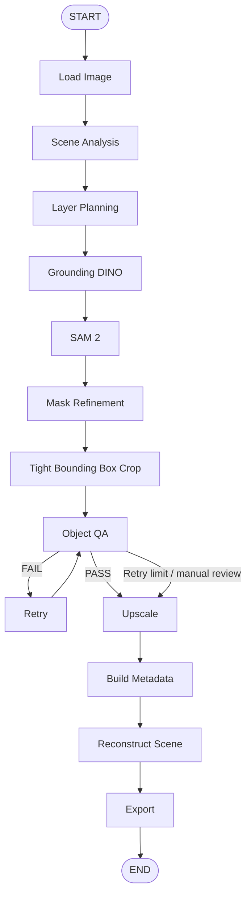

# Agentic 2D Game Scene Reconstruction Pipeline

基于 **LangGraph** 的 2D / 2.5D Isometric 游戏场景重建工程框架。
输入完整地形图，输出语义层计划、实例 mask、紧凑透明 PNG、高清纹理、
原图坐标、pivot、Y-sort、`scene.json` 和重建预览。

V1 的重点是**可运行且可逐步替换模型的框架**。Mock 不理解真实图像内容：
类别固定，检测框按图像比例生成，SAM 返回矩形 mask，高清化采用 Pillow Lanczos。
重建图只包含这些矩形选区，未提取的草地、道路等区域透明。它验证坐标与合成流程，
**不代表已经实现完整地图的语义分割、无损还原或生成式超分**。

V1 已通过真实 LangGraph 端到端验收：38 项测试全部通过，正常、强制重试、
零重试预算三次 CLI 均到达 END。产物分别位于 `output/test/`、
`output/test_retry/`、`output/no_retry/`，详细结果见 [VERIFICATION.md](VERIFICATION.md)。

## 安装与运行

推荐 Python 3.11+。仓库根目录就是设计中的 `scene_reconstructor/` 项目根，
直接保留 `agent/`、`nodes/`、`services/` 等目录，避免多套启动路径。

```bash
python3 -m venv .venv
source .venv/bin/activate
python -m pip install -r requirements.txt

# 自动生成 640 × 480 的简单测试地图
python -m app.demo --output input/test.png

# 实际调用 graph.invoke(...)
python main.py --input input/test.png --output output/test --mock

# 注入一个低置信度 Mock 对象，验证 retry → QA
python main.py --input input/test.png --output output/test_retry --mock --exercise-retry

# 验证不允许 retry 时转入人工复核
python main.py --input input/test.png --output output/no_retry --mock --exercise-retry --max-retry 0

# 标准库 unittest，无需额外安装 pytest
python -m unittest discover -s tests -v
```

省略 `--output` 时默认写入仓库的 `output/<输入文件名>/`。
`--mock` / `--real` 覆盖 YAML 配置；配置默认 `mock: true`。
当前真实检测/分割/超分适配器未实现，`--real` 会明确报错，不会静默回退到 Mock。
Mock 模式无需 API key、不发起模型请求、不下载模型权重。

终端打印正常路径的 12 个阶段；retry 另行标记。图中实际有 13 个业务节点，
另有 START / END。完成时打印 `Done. Reached END.`，
`debug/run.json` 保存节点访问顺序及最终可序列化 State。

## Architecture

采用 **Deterministic Backbone + Agentic Decision Nodes**。
LangGraph 管理固定流程、条件路由、有限重试及 checkpoint；
LangChain 提供可注入的 VLM 调用、提示词和 Pydantic structured output；
CV 与模型服务负责像素处理。没有自由选择工具的 Agent。



只有失败对象非空且 `retry_count < max_retry` 才进入 retry，默认上限 1。
耗尽预算的失败对象保留 `manual_review`、QA reason 和原始置信度，之后继续导出。
有效但未通过 QA 的 cutout 仍可供人工查看；空 mask 不生成伪 PNG。

## 目录与职责

```text
app/          配置、路径、可复用对象操作、测试图生成器
agent/        SceneState、router、真实 LangGraph 图构建
nodes/        每个阶段独立模块，future.py 预留未来节点
services/     VLM、Grounding、SAM、Upscale、Layered、Image Edit
cv/           bbox、mask、crop、alpha、metrics、pivot、reconstruct
schemas/      Pydantic SceneAnalysis / SceneObject / ObjectQA / SceneManifest
exporters/    JSON / PNG；PSD / Godot 为显式占位接口
prompts/      场景分析提示词、未来 QA 提示词
config/       pipeline.yaml / categories.yaml / models.yaml
input/        输入图（demo 自动创建）
output/       每张场景的独立输出
tests/        CV、schema、router、config、graph 集成测试
main.py       CLI
requirements.txt
.env.example
```

所有业务节点接收 `state: SceneState`，返回 `dict` 状态增量。
需要依赖的节点通过 `make_<node>(service/config)` 创建闭包，闭包函数仍只有
`state` 一个参数；`services/runtime.py` 统一初始化模型服务，节点不初始化模型。
支持传入自定义 `ServiceBundle`、分类 YAML 和进度回调，无全局可变状态。

## State 与 Schema

`agent/state.py` 只保留以下 15 个字段：

`source_path`、`output_dir`、`width`、`height`、`scene_analysis`、
`layer_plan`、`detections`、`objects`、`failed_objects`、
`retry_count`、`max_retry`、`reconstruction_path`、
`reconstruction_score`、`scene_json`、`exported_assets`。

State 中只保存 JSON 可序列化记录与绝对文件路径，
不保存 ndarray、图像、服务实例或模型。SAM 的临时数组在 node 返回前持久化为 PNG。
`scene_json` 表示导出的文件路径。

Pydantic 验证 projection 枚举、有效 bbox、置信度、QA 状态及 retry strategy。
`SceneObject` 除题设字段外还保留 `qa`、`metrics`、`error` 和
`mock_retry_resolved`，便于检查失败与模拟行为。

## 坐标与纹理约定

- `bbox`：检测框，在原图的左上角原点像素坐标中表示为 x/y/w/h。
- `crop_bbox`：mask > alpha_threshold 的紧框，加 padding 后限制在原图内。
  右、下边界为 exclusive，单像素 mask 的宽高为 1。
- mask PNG 为原图尺寸的灰度图；**assets PNG 为紧凑裁剪尺寸**。
  RGB 来自原图，Alpha 来自 mask。
- `pivot`：原始 crop 内最底部有效 alpha 像素的平均 x 和底行像素中心 y；
  空 alpha 的独立工具回退到 bottom center。没有改变地图坐标。
- `z_order = crop_bbox.y + pivot.y`。重建按该值升序 alpha composite。
- `logical_size`：原始裁剪尺寸；`texture_size`：高清图尺寸；
  `texture_scale` 只影响纹理，不影响坐标、pivot 或画布尺寸。
- 放大长边区间：<128 → 4x，128–256 → 3x，>256–512 → 2x，>512 → 1x。
- 无显式 EXIF 旋转校正：坐标对应 Pillow 解码的原始像素布局；
  输入最好使用已经定向的 PNG。

`reconstruction_score` 是整个画布上的
`1 - mean(abs(source_RGBA - reconstruction_RGBA)) / 255`。
透明缺失区域也纳入计算，它只是像素差异诊断，不能证明语义质量。

## 输出

```text
output/test/
├── assets/              tree_001.png、rock_001.png 等紧凑 RGBA
├── assets_hd/           tree_001@3x.png 等 Lanczos 纹理
├── masks/               原图尺寸的实例灰度 mask
├── debug/run.json       运行节点顺序及最终 state
├── scene.json
└── reconstruction.png
```

`scene.json` 包含 scene、layers、objects、mock、retry_count、
unresolved_objects 和 reconstruction 信息。
每个对象含 `asset` / `hd_asset` 以及对应的 `asset_path` / `hd_asset_path`，
导出路径均相对 scene.json，采用 POSIX 分隔符，可以移动整个输出目录。
`scene.json` 的 mock 标记明确表明输出来源。

重复使用相同输出目录会覆盖当前对象的同名文件，但不会删除旧运行的其他文件；
消费者应以本次 `scene.json` 的引用为准。并发运行请使用不同输出目录。

## 配置与 QA

`config/pipeline.yaml` 中的 mock、max_retry、crop、qa、
upscale.enabled、reconstruction.enabled 均实际接入节点。
`config/categories.yaml` 控制确定性的语义层分组；V1 生成的是层计划，
不是语义层 PNG。`config/models.yaml` 是未来适配器的配置草案，
尚不加载模型或权重，不应把其中 provider 字符串视为已实现能力。

QA 首先检查空/异常 mask 和资产，再检查置信度与 occupancy。
`occupancy = 有效 mask 像素数 / crop_bbox 面积`。
过度增加 padding 会降低该指标，所以低 occupancy 默认请求重新分割；
未来 agent 可以根据原因选择其他策略。

Mock retry 会重新生成失败对象的 mask 和 crop，再显式模拟通过，
保留原始低置信度及说明，不伪造置信度提升。
真实模式目前只预留有限次重新分割；change_prompt、expand_crop、
merge_neighbor_tiles 的智能诊断与执行是后续 TODO。

## Checkpoint / Human-in-the-loop 接口

```python
from langgraph.checkpoint.memory import InMemorySaver
from agent.graph import build_graph

graph = build_graph(
    checkpointer=InMemorySaver(),
    interrupt_before=["upscale_objects"],
)
run_config = {"configurable": {"thread_id": "scene-review-001"}}
graph.invoke({
    "source_path": "input/test.png",
    "output_dir": "output/review",
}, run_config)

# 暂停在 QA 后；人工可以检查已落盘的 assets 和 state。
snapshot = graph.get_state(run_config)
print(snapshot.next)  # ("upscale_objects",)
graph.invoke(None, run_config)  # 继续到 END
```

这是 checkpoint 与阶段暂停/继续的接口，不包含 UI，也不会自动替代人工批准。
需要持久化 checkpoint 时再安装并注入相应数据库 saver。
由于状态引用的是磁盘文件，恢复前必须保留输入图与已产生资产。

## 接入真实模型

| 能力 | 接入位置 | 当前情况 |
|---|---|---|
| Qwen-VL | services/vlm_service.py | 固定 Mock；可注入支持 structured output 的 LangChain chat model |
| Grounding DINO | services/grounding_service.py | 比例框 Mock；真实 detect 待实现 |
| SAM 2 | services/sam_service.py | 矩形 mask Mock；真实 segment 待实现 |
| Real-ESRGAN | services/upscale_service.py | Pillow Lanczos Mock；真实 upscale 待实现 |
| Qwen-Image-Layered | services/qwen_layered_service.py、nodes/future.py | Mock 单层原图引用；未加入主图 |
| Qwen-Image-Edit / Inpainting | services/image_edit_service.py、nodes/future.py | Mock 无操作；遮挡推断与补全待实现 |
| PSD / Godot | exporters/psd_exporter.py、exporters/godot_exporter.py | 显式 NotImplementedError；不影响 V1 |

Grounding DINO、SAM 2、Real-ESRGAN、Qwen-Image-Layered 等需要后续
分别安装各自的模型依赖与权重。第一版 requirements.txt 仅列出
langgraph、langchain、pydantic、pillow、numpy、opencv-python、pyyaml、
python-dotenv，没有 torch、transformers 或任何模型包。

## 测试范围与剩余 TODO

测试覆盖精确 bbox、padding 越界、空 mask、RGB/alpha、crop 紧凑性、
重建坐标与 alpha 混合、Y-sort、pivot、scale 边界、schema 校验、配置、
正常 graph、强制 retry、持续失败耗尽预算、无检测、checkpoint 暂停/恢复。

后续逐步实现：真实模型适配器、语义层图像、遮挡补全、CV+VLM QA、
retry diagnosis、tile 合并、背景覆盖与所有权处理、持久化 saver、
人工交互 UI、PSD 与 Godot 导出。
