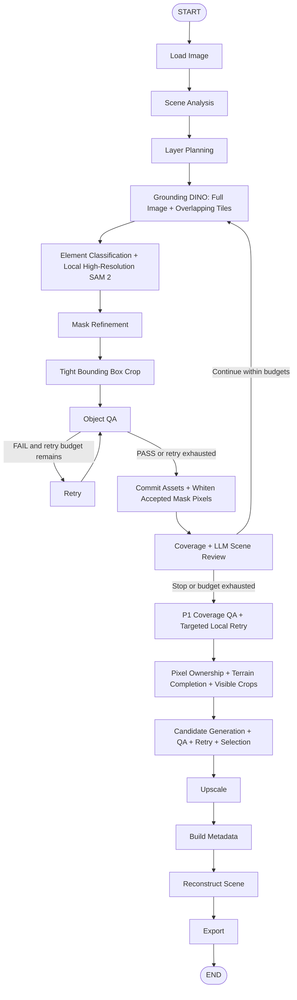
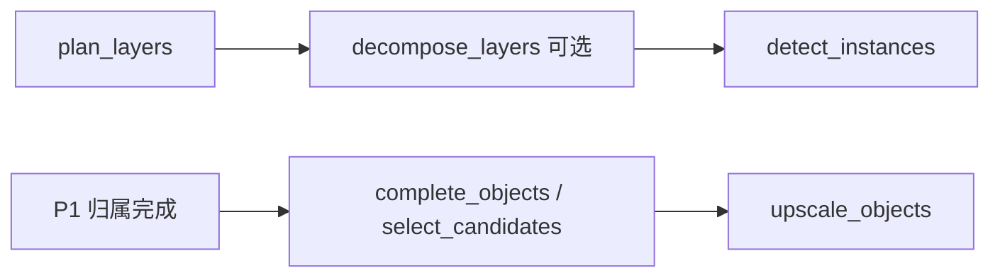

# Agentic 2D Game Scene Reconstruction Pipeline

基于 **LangGraph** 的 2D / 2.5D Isometric 游戏场景重建工程框架。
输入完整地形图，输出语义层计划、实例 mask、紧凑透明 PNG、高清纹理、
原图坐标、pivot、Y-sort、`scene.json` 和重建预览。

V1 的重点是**可运行且可逐步替换模型的框架**。Mock 不理解真实图像内容：
类别固定，检测框按图像比例生成，SAM 返回矩形 mask，高清化采用 Pillow Lanczos。
P1 默认将未分类原图像素保存在明确标记的 residual 背景层；这些像素不计入语义覆盖率。
关闭 P1 后，重建图仍只包含矩形选区，未提取区域透明。Mock 验证坐标与合成流程，
**不代表已经实现完整地图的语义分割、无损还原或生成式超分**。

已接入真实 Grounding DINO（Transformers）和官方 SAM 2.1，并在 CPU 上完成
在线下载及离线推理验收。真实产物位于 `output/real_test/`；原 Mock 模式仍保留。
初始类别来自配置；场景循环支持 LangChain 视觉 LLM 审查，默认使用明确标记的规则模式。
现已加入独立 Real-ESRGAN 本地后端；Mock 的 Lanczos 仅是插值预览。真实高清质量尚未使用权重验收。历史检测/分割结果见
[VERIFICATION.md](VERIFICATION.md)。

Qwen-Image-Layered / Qwen-Image-Edit 的本地适配、可选节点与导出接口也已实现。
本次仅进行无权重的代码接入：两个 `model_path` 均为空、节点默认关闭，
未安装 Qwen 依赖、未下载 Qwen 权重、未进行 Qwen 神经网络推理。

## 工程评测与验收

生产流程已接入 ROI Benchmark、共享检测预算、区域类别分配、基础资产/高清状态分离、schema 1.2 迁移和 PSD 磁盘缓冲。默认高清关闭。终端优先报告语义覆盖与资产状态；residual 带来的高重建相似度不表示拆分完整。完整配置审计、指标定义、可执行命令、兼容边界见 [docs/ENGINEERING_EVALUATION.md](docs/ENGINEERING_EVALUATION.md)。

## P0 高召回检测（2026-09-30）

默认 graph 使用整图 + 1024/1536 重叠切片、10 组细分类别的区域分配、共享扫描预算、候选来源追踪、
多特征融合、边缘复检、小目标复核保护，以及自动 `diagnostics/report.html`。
新策略集中配置在 `config/pipeline.yaml:detection`，覆盖旧模型配置中的 Tile/NMS 策略。
实体 PNG 继续使用原有 assets 路径；环境特效单独存储。

实现边界、字段、配置优先级、诊断解释和真实小目标冒烟结果见
[docs/DETECTION_P0.md](docs/DETECTION_P0.md)。测试验证机制正确性；真实召回率仍需标注集对照。

## P1 地形分层与像素归属（2026-09-30）

默认启用局部高分辨率 SAM、多候选评分、类别化后处理、terrain / instance / hybrid / effect
分类、可见像素唯一归属，以及按失败原因触发的局部重试。地形按语义类别合并，
原始候选 mask、可见 mask 和推测补全结果分别保存。

独立的 `p1_scene` 和 `assign_ownership` 节点在对象补全、高清化之前运行。
输出包含 `metadata/summary.json`、`scene.json` 中的 P1 汇总、归属图、未分配图和重建差异图。
配置、重试预算、指标解释和实现边界见 [docs/P1_DECOMPOSITION.md](docs/P1_DECOMPOSITION.md)。

## P2 候选回接与资源管理（2026-09-30）

每个可见实例通过 Candidate Registry、QA/有限重试和排名选出唯一 `accepted_asset`。
后续高清化、场景 PNG 与 PSD 图层使用该资产；保留原始空间信息，重建生成 alpha 的 mask。
所有节点接入模型生命周期、版本化推理缓存、资源恢复和性能统计。
默认生成仍关闭；候选选择、`scene.psd`、`performance_report.json`、`timeline.html` 默认输出。
配置、回退规则与验证边界见 [docs/P2_CANDIDATES_RESOURCES.md](docs/P2_CANDIDATES_RESOURCES.md)。

## 安装与运行

推荐 Python 3.11+。仓库根目录就是设计中的 `scene_reconstructor/` 项目根，
直接保留 `agent/`、`nodes/`、`services/` 等目录，避免多套启动路径。

```bash
python3 -m venv .venv
source .venv/bin/activate
python -m pip install -r requirements.txt

# 自动生成 640 × 480 的简单测试地图
python -m app.demo --output input/test.png

# 实际调用 graph.invoke(...)
python main.py --input input/test.png --output output/test --mock

# 注入一个低置信度 Mock 对象，验证 retry → QA
python main.py --input input/test.png --output output/test_retry --mock --exercise-retry

# 验证不允许 retry 时转入人工复核
python main.py --input input/test.png --output output/no_retry --mock --exercise-retry --max-retry 0

# 标准库 unittest，无需额外安装 pytest
python -m unittest discover -s tests -v
```

省略 `--output` 时默认写入仓库的 `output/<输入文件名>/`。
`--mock` / `--real` 覆盖 YAML 配置；配置默认 `mock: true`。
`--real` 启用 Grounding DINO + SAM 2；模型加载失败会明确报错，不会静默回退到 Mock。
Mock 模式无需 API key、不发起模型请求、不下载模型权重。

终端打印实际启用的阶段；检测循环会重复打印对应阶段，retry 另行标记。完成时打印 `Pipeline completed (<status>)` 和分层指标，
`debug/run.json` 保存节点访问顺序及最终可序列化 State。

## Architecture

采用 **Deterministic Backbone + Agentic Decision Nodes**。
LangGraph 管理固定流程、条件路由、有限重试及 checkpoint；
LangChain 提供可注入的 VLM 调用、提示词和 Pydantic structured output；
CV 与模型服务负责像素处理。没有自由选择工具的 Agent。



只有失败对象非空且 `retry_count < max_retry` 才进入 retry，默认上限 1。
耗尽预算的失败对象保留 `manual_review`、QA reason 和原始置信度，之后继续导出。
有效但未通过 QA 的 cutout 仍可供人工查看；空 mask 不生成伪 PNG。

## 目录与职责

```text
app/          配置、路径、可复用对象操作、测试图生成器
agent/        SceneState、router、真实 LangGraph 图构建
nodes/        每个阶段独立模块，future.py 预留未来节点
services/     VLM、Grounding、SAM、Upscale、Layered、Image Edit
cv/           bbox、mask、crop、alpha、metrics、pivot、reconstruct
schemas/      Pydantic SceneAnalysis / SceneObject / ObjectQA / SceneManifest
exporters/    JSON / PNG / PSD；Godot 为显式占位接口
candidates/   候选注册、QA、生成/重试、选择、坐标/alpha 回接
prompts/      场景分析提示词、未来 QA 提示词
config/       pipeline.yaml / categories.yaml / models.yaml
input/        输入图（demo 自动创建）
output/       每张场景的独立输出
tests/        CV、schema、router、config、graph 集成测试
main.py       CLI
requirements.txt
.env.example
```

所有业务节点接收 `state: SceneState`，返回 `dict` 状态增量。
需要依赖的节点通过 `make_<node>(service/config)` 创建闭包，闭包函数仍只有
`state` 一个参数；`services/runtime.py` 统一初始化模型服务，节点不初始化模型。
支持传入自定义 `ServiceBundle`、分类 YAML 和进度回调，无全局可变状态。

## State 与 Schema

`agent/state.py` 的基础字段：

`source_path`、`output_dir`、`width`、`height`、`scene_analysis`、
`layer_plan`、`detections`、`objects`、`failed_objects`、
`retry_count`、`max_retry`、`reconstruction_path`、
`reconstruction_score`、`scene_json`、`exported_assets`。

Qwen 扩展增加 3 个可选字段：`decomposed_layers`（图层记录）、
`edit_requests`（显式编辑请求）、`object_edits`（编辑候选记录）。

State 中只保存 JSON 可序列化记录与绝对文件路径，
不保存 ndarray、图像、服务实例或模型。SAM 的临时数组在 node 返回前持久化为 PNG。
`scene_json` 表示导出的文件路径。

Pydantic 验证 projection 枚举、有效 bbox、置信度、QA 状态及 retry strategy。
`SceneObject` 除题设字段外还保留 `qa`、`metrics`、`error` 和
`mock_retry_resolved`，便于检查失败与模拟行为。

## 坐标与纹理约定

- `bbox`：检测框，在原图的左上角原点像素坐标中表示为 x/y/w/h。
- `crop_bbox`：源可见资产是 alpha > threshold 的紧框；完成资产是扩展画布内的 alpha 紧框，允许负坐标和越出场景。
  右、下边界为 exclusive，单像素 mask 的宽高为 1。
- visible/source mask PNG 为原图尺寸灰度图；reconstructed mask 为完整资产局部画布 alpha；**assets PNG 为紧凑裁剪尺寸**。
  RGB 来自原图，Alpha 来自 mask。
- `pivot`：原始 crop 内最底部有效 alpha 像素的平均 x 和底行像素中心 y；
  空 alpha 的独立工具回退到 bottom center。没有改变地图坐标。
- `z_order = crop_bbox.y + pivot.y`。重建按该值升序 alpha composite。
- `logical_size`：原始裁剪尺寸；`texture_size`：高清图尺寸；
  `texture_scale` 只影响纹理，不影响坐标、pivot 或画布尺寸。
- 放大倍率由 `services.upscale_service.resolve_upscale_factor` 统一解析：长边 `<128` 为 4x，其余为 2x；`choose_scale` 仅作为旧调用的兼容别名。高清是可选增强，不改变基础资产 QA。
- 无显式 EXIF 旋转校正：坐标对应 Pillow 解码的原始像素布局；
  输入最好使用已经定向的 PNG。

`reconstruction_score` 是整个画布上的
`1 - mean(abs(source_RGBA - reconstruction_RGBA)) / 255`。
透明缺失区域也纳入计算，它只是像素差异诊断，不能证明语义质量。

## 输出

```text
output/test/
├── assets/              tree_001.png、rock_001.png 等紧凑 RGBA
├── assets_hd/           tree_001@2x.png / @4x.png（后端与 QA 写入元数据）
├── masks/               原图尺寸的实例灰度 mask
├── debug/run.json       运行节点顺序及最终 state
├── scene.json
└── reconstruction.png
```

`scene.json` 包含 scene、layers、objects、mock、retry_count、
unresolved_objects 和 reconstruction 信息。
每个对象含 `asset` / `hd_asset` 以及对应的 `asset_path` / `hd_asset_path`，
导出路径均相对 scene.json，采用 POSIX 分隔符，可以移动整个输出目录。
`scene.json` 的 mock 标记明确表明输出来源。

重复使用相同输出目录会覆盖当前对象的同名文件，但不会删除旧运行的其他文件；
消费者应以本次 `scene.json` 的引用为准。并发运行请使用不同输出目录。

## 配置与 QA

`config/pipeline.yaml` 中的 mock、max_retry、crop、qa、
upscale.enabled、reconstruction.enabled 均实际接入节点。
`config/categories.yaml` 控制确定性的语义层分组；默认只生成层计划。
开启 Qwen Layered 后另外导出图层 PNG，不将生成层假定为配置中的语义类别。
`config/models.yaml` 实际控制设备、缓存、类别、投影、
Grounding DINO 模型/阈值/NMS 和 SAM 2 模型配置/权重。

QA 首先检查空/异常 mask 和资产，再检查置信度与 occupancy。
`occupancy = 有效 mask 像素数 / crop_bbox 面积`。
过度增加 padding 会降低该指标，所以低 occupancy 默认请求重新分割；
未来 agent 可以根据原因选择其他策略。

Mock retry 会重新生成失败对象的 mask 和 crop，再显式模拟通过，
保留原始低置信度及说明，不伪造置信度提升。
真实模式会对失败对象在带 padding 的局部图中重新 SAM 分割，然后恢复原图坐标；
检测置信度保持不变，因此单纯局部分割不会把低置信候选强行通过。
场景循环只对剩余/gap 区域追加检测；P1 retry 会按原因执行 candidate recovery、局部 mask repair、类别复核或跨 Tile 完整轮廓复检，并要求质量改进才替换。生成式 amodal completion 使用独立候选与生成预算。

## Checkpoint / Human-in-the-loop 接口

```python
from langgraph.checkpoint.memory import InMemorySaver
from agent.graph import build_graph

graph = build_graph(
    checkpointer=InMemorySaver(),
    interrupt_before=["upscale_objects"],
)
run_config = {"configurable": {"thread_id": "scene-review-001"}}
graph.invoke({
    "source_path": "input/test.png",
    "output_dir": "output/review",
}, run_config)

# 暂停在 QA 后；人工可以检查已落盘的 assets 和 state。
snapshot = graph.get_state(run_config)
print(snapshot.next)  # ("upscale_objects",)
graph.invoke(None, run_config)  # 继续到 END
```

这是 checkpoint 与阶段暂停/继续的接口，不包含 UI，也不会自动替代人工批准。
需要持久化 checkpoint 时再安装并注入相应数据库 saver。
由于状态引用的是磁盘文件，恢复前必须保留输入图与已产生资产。

## 接入真实模型

| 能力 | 接入位置 | 当前情况 |
|---|---|---|
| Qwen-VL | services/qwen_vl_backend.py、services/vlm_service.py | 本地 Transformers 推理 + LangChain/Pydantic 结构化输出；分析与 Scene QA 共享后端；权重留空 |
| Grounding DINO | services/grounding_service.py | Transformers 真实推理、坐标裁剪、类别匹配、class-aware NMS |
| SAM 2 | services/sam_service.py | Meta 官方 SAM 2.1；bbox prompt、原尺寸 mask、最佳候选选择 |
| Real-ESRGAN | services/upscale_service.py | 本地 RealESRGAN_x4plus、分块推理、完成轮廓锁定、独立视觉 QA；权重留空 |
| Qwen-Image-Layered | services/qwen_layered_service.py、nodes/decompose_layers.py | 本地 Diffusers 适配、可选节点、RGBA 导出；权重留空；Mock 单层透传 |
| Qwen-Image-Edit | services/image_edit_service.py、nodes/complete_objects.py | 本地 Diffusers 编辑、mask 合成、候选导出；权重留空；Mock 无修改 |
| PSD / Godot | exporters/psd_exporter.py、exporters/godot_exporter.py | PSD 输出真实 RGBA 图层；Godot 仍为占位接口 |

Grounding DINO、SAM 2 与 Qwen 的可选依赖方式见下文。Real-ESRGAN 使用
`requirements-upscale.txt` 和 `models.yaml:upscale.checkpoint`。基础 requirements.txt 仅列出
langgraph、langchain、pydantic、pillow、numpy、opencv-python、pyyaml、
python-dotenv、psutil，没有 torch、transformers 或任何模型包。

## 测试范围与剩余 TODO

测试覆盖精确 bbox、padding 越界、空 mask、RGB/alpha、crop 紧凑性、
重建坐标与 alpha 混合、Y-sort、pivot、scale 边界、schema 校验、配置、
正常 graph、强制 retry、持续失败耗尽预算、无检测、checkpoint 暂停/恢复。

后续工作：Qwen 真实权重与 CUDA 峰值验收、生成质量评估、Real-ESRGAN 真实质量验收、
持久化 saver 和人工复核 UI、Godot 导出。P1/P2 已实现的能力和具体边界以对应文档为准。

### 本地 Qwen-VL：场景分析与 Scene QA

真实模式的场景分析现在使用本地 Qwen-VL；`pipeline.yaml` 和代码默认值中的
`scene_loop.reviewer` 已切换为 `llm`，`models.yaml` 的 `scene_reviewer.provider` 默认为
`local`。两者共享同一惰性后端，由资源管理器统一加载、卸载及处理 OOM，权重与推理参数
参与缓存标识。默认阶段结束释放模型；可通过 `resources.keep_alive.qwen_vl` 保留 CPU
副本，具体内存预算需按实际模型调整。

支持 Transformers 的 **Qwen2.5-VL / Qwen3-VL Instruct（非 MoE）** 模型目录。
目录必须包含 `config.json`、safetensors 权重和完整 processor/tokenizer/chat template 文件。
本次只实现代码：`qwen_vl.model_path` 保持 `null`，没有下载权重。

后续准备好本地模型时：

```bash
.venv/bin/python -m pip install -r requirements-vlm.txt
# 在 config/models.yaml 中填写 qwen_vl.model_path 后运行；其他启用模型也需配置。
.venv/bin/python main.py --input input/test.png --output output/local_vlm --real --offline
```

```yaml
# config/models.yaml
qwen_vl:
  model_path: null  # 后续填写本地目录；相对路径基于 YAML 所在目录
  dtype: auto
  image_long_edge: 1536
  max_images: 4
  max_input_tokens: 16384
  max_new_tokens: 2048
scene_reviewer:
  provider: local
```

本地后端始终使用 `local_files_only=True`、`trust_remote_code=False`，无需 API key，
不会回退到 Hub 下载。模型路径为空时，在加载 DINO/SAM 和进入工作流之前明确报错。
`--scene-reviewer rules` 只切换审查方式，真实场景分析仍需要 Qwen-VL。
`--mock` 继续使用固定场景分析和规则 QA，无需这些可选依赖。

推理通过多模态 chat template 输入图像，用确定性生成返回 JSON，仅解码新增 token。
LangChain runnable 用 JSON schema 提示并经 Pydantic 校验；这不是原生 tool calling
或保证有效 JSON 的约束解码。Scene QA 的解析/推理异常会进入 `manual_review`，不自动切换
为规则通过；场景分析异常会终止运行。对象分类、候选 QA、遮挡分析复用该视觉接口。

测试使用替身覆盖本地加载参数、图像/上下文上限、token 裁剪、结构校验、共享生命周期、
缓存失效和 QA 异常路径。真实权重兼容性、视觉准确性、速度和显存峰值仍需实机验收。

## Grounding DINO + SAM 2 真实模式

推荐 Python 3.11/3.12。保持基础依赖轻量，模型依赖另行安装：

```bash
source .venv/bin/activate
python -m pip install -r requirements.txt
python -m pip install -r requirements-vision.txt
python -m pip install -r requirements-vlm.txt
# 官方 SAM 2 固定源码提交。CPU/macOS 无需编译 CUDA 扩展：
SAM2_BUILD_CUDA=0 python -m pip install --no-build-isolation -r requirements-sam2.txt

# 先填写 qwen_vl.model_path；启用的超分/生成模型另行配置。
python main.py --input input/test.png --output output/real_test --real
# 下载完成后可完全离线运行；找不到文件会报错，不访问 Hub：
python main.py --input input/test.png --output output/real_test --real --offline --device cpu
```

CUDA 机器先按 PyTorch 官方安装说明选择匹配 CUDA 的 torch/torchvision。
官方 SAM 2 使用固定提交 `2b90b9f5ceec907a1c18123530e92e794ad901a4`。
本适配器关闭依赖 CUDA 扩展的后处理，CPU 推理也能得到原图尺寸的 mask。

默认模型为 `IDEA-Research/grounding-dino-tiny` 和
`facebook/sam2.1-hiera-tiny`。首次运行下载约 0.8GB 权重至仓库
`.cache/models/`，输入图只在本地处理。模型惰性加载且复用，Mock 不导入 torch/模型包，
无检测时 SAM 不加载。SAM 每次分割调用只编码一次图像，依次用 bbox 解码各对象；
不同 graph 并发执行请创建独立 ServiceBundle（SAM predictor 有图像状态）。

使用 `--models-config path/to/models.yaml` 可替换配置：

- `device`: `auto` 优先 CUDA，否则 CPU；`cpu`、`cuda`、`mps` 可显式指定。
  MPS 为可选实验路径，本次只实测 CPU，不做设备出错后的静默回退。
- `cache_dir`: Hub 缓存；相对路径基于 YAML 文件目录。
- `local_files_only`: 离线加载；CLI `--offline` 可覆盖为 true。
- `categories` / `projection`: 供显式注入 `ConfiguredSceneService` 的兼容配置。
  默认真实流程由本地 Qwen-VL 推断类别与投影，不使用固定语义作为自动回退。
- `grounding.model_id`: Hub ID 或本地 Transformers 模型目录；本地相对路径以 `./` 开头。
- `grounding.revision` / `sam.revision`: 可设置固定 Hub commit 以重现模型版本。
- `grounding.box_threshold` / `text_threshold`: 模型结果与文本匹配阈值。
- `grounding.nms_iou`: 同类别 IoU 去重阈值；不同类别可能仍覆盖同一物体。
- `grounding.max_detections`: 进入 SAM 的对象数上限。
- `sam.model_config_name`: 官方 SAM 2 内置配置名，必须与 checkpoint 匹配。
- `sam.checkpoint`: 本地 `.pt` 权重；非空时必须存在，不会回退到 Hub。
  留空时从 `sam.repo_id` / `filename` 下载并缓存。
- `sam.multimask_output`: 可输出多个候选，按 SAM 预测质量分选最佳；检测置信度保持不变。
- `sam.mask_threshold`: SAM mask logits 阈值；落盘仍为 0/255 uint8 灰度 mask。

原图 xywh 检测框先 floor/ceil、裁剪边界、删除无效框及 NMS，
再转换为 SAM 的像素 xyxy box prompt。mask 回到原图分辨率后复用已有
refine/crop/QA/metadata/reconstruct/export 节点。没有手工框替换真实检测结果。

`scene.json.backends` 明确记录：

```json
{
  "analysis": "qwen_vl_local",
  "grounding": "grounding_dino_transformers",
  "segmentation": "sam2_official",
  "scene_review": "llm",
  "scene_review_provider": "qwen_vl_local",
  "upscale": "real_esrgan"
}
```

`mock: false` 表示当前采用真实检测/分割路径，不代表 Qwen-VL、
Real-ESRGAN 或所有模型均已完成真实质量验收。`debug/run.json.models` 保存本次模型配置。

### 本次实测范围

在合成地图上真实检测到 6 个候选，完成 SAM 分割和 1 次重试后到达 END；
4 个通过规则 QA，2 个保持 manual_review。建筑和岩石得到非矩形透明轮廓。
该简单测试图仍出现道路/桥梁的大范围误检及树木漏检，说明通用 tiny 模型
需要针对真实游戏图调整英文提示、阈值及 QA，不能据此宣称语义准确率达标。
场景级大对象的 crop 可能接近整图尺寸，这是实际 mask 覆盖范围，不是裁剪失效。

## Qwen 可选节点：代码已接入，模型留空

默认配置保持：

```yaml
# config/pipeline.yaml
layer_decomposition:
  enabled: false
object_completion:
  enabled: false

# config/models.yaml（另一份配置文件）
qwen_layered:
  model_path: null
qwen_image_edit:
  model_path: null
```

两个模型只接受**本地完整 Diffusers 模型目录**，加载器始终传入
`local_files_only=True`，不受 Grounding/SAM 的在线配置影响。
`null` / 空字符串表示未配置；显式启用真实节点而未配置目录时，在图构建阶段
清晰报错，早于任何检测推理。不会回退到 Mock 或尝试默认 Hub 模型。
模型目录相对 `models.yaml` 解析，至少需要 `model_index.json` 及其引用的组件。

后续准备好本地模型时，再安装独立的 `requirements-qwen.txt` 并填写目录。
本次没有执行该安装。适配器分别使用 Diffusers 的 `QwenImageLayeredPipeline`
和 `QwenImageEditPipeline`；Image Edit 对应原版单图管线，不自动兼容 Edit Plus
或任意新变体。依赖版本范围与真实推理尚待模型就绪后验证。

两个适配器均惰性加载、复用实例，支持配置 `dtype`、`num_inference_steps`、
`true_cfg_scale`、`negative_prompt` 与 `seed`。Layered 还支持 `layers`、
`resolution`、`cfg_normalize`、`use_en_prompt`。设备沿用 `models.yaml.device`；
`dtype: auto` 在 CUDA 选择 bfloat16，其他设备选择 float32。



未开启生成时仍走 select_candidates 选择原始资产。节点只返回状态增量，模型对象不进入
checkpoint；候选 RETRY 根据失败原因修改 prompt，受独立生成预算限制。

### 无模型 Demo

仅启用 Layered Mock：

```bash
.venv/bin/python main.py --input input/test.png --output output/qwen_layers_demo \
  --mock --decompose-layers
```

Layered Mock 生成一个像素不变的 RGBA 层，标记 `mock_passthrough`，
不伪造语义分层。真实 Layered 适配器接收 RGBA 层列表，保留模型 alpha，
必要时将完整图层画布缩放回输入场景尺寸，并同时记录 `model_size` 和 `canvas_size`。
`order` 只记录返回顺序；图层语义、遮挡关系与正确合成顺序仍需验证。

Image Edit 支持以下显式重建请求；启用生成后也可根据遮挡/缺损 QA 自动选择修复策略：

```json
[
  {
    "object_id": "tree_001",
    "mask_path": "tree_mask.png",
    "prompt": "Reconstruct the complete tree including the hidden trunk and roots, preserving its style."
  }
]
```

`mask_path` 相对请求 JSON 解析。mask 必须是**原始裁剪资产尺寸**，
不是整张场景尺寸，也不是高清纹理尺寸。请求 mask 作为修复区域提示归档；
重建模式会扩大允许编辑的区域，黑色不再冻结最终轮廓。扩展 edit mask 与输出 alpha 相互独立。
空 mask、重复对象 ID、未知对象、空提示词、尺寸不匹配会报错或写入候选失败记录。
无显式请求时，自动策略仍会分析遮挡并为需要补全的对象创建候选。

可从一次 Mock 基线运行生成测试请求，再完整运行两个节点：

```bash
.venv/bin/python main.py --input input/test.png --output output/qwen_baseline --mock
.venv/bin/python - <<'PY'
import json
from pathlib import Path
from PIL import Image

root = Path("input/qwen_demo_edits")
root.mkdir(parents=True, exist_ok=True)
scene = json.loads(Path("output/qwen_baseline/scene.json").read_text(encoding="utf-8"))
obj = scene["objects"][0]
Image.new("L", tuple(obj["logical_size"]), 255).save(root / "tree_mask.png")
requests = [{"object_id": obj["id"], "mask_path": "tree_mask.png", "prompt": "Reconstruct the complete tree including the hidden trunk and roots, preserving its style."}]
(root / "requests.json").write_text(json.dumps(requests, indent=2), encoding="utf-8")
PY
.venv/bin/python main.py --input input/test.png --output output/qwen_mock_demo \
  --mock --decompose-layers --edit-requests input/qwen_demo_edits/requests.json \
  --exercise-retry
```

Image Edit Mock 在透明扩展画布上透传可见像素，并标记 `mock_noop`。
真实适配器返回 RGB 生成结果，不贴回旧 alpha。Qwen 单图管线没有原生 mask 参数，
edit mask 仅控制 RGB 合成；语义 amodal 预测作为结构/坐标提示，并用于后续 SAM 多候选选择。
生成后重新分割、局部 trimap 边缘估计、清理微小噪点和孔洞，再做面积/位置/视觉 QA。
补全资产保持场景尺度，允许负 crop 坐标；独立 PNG 不按原场景边界裁切。
完整说明与真实模型配置见 [遮挡重建与高清修复](docs/AMODAL_RECONSTRUCTION.md)。
Qwen、VLM 与 Real-ESRGAN 真实质量仍需配置本地权重/视觉端点后验收。

### 新增输出与边界

```text
output/qwen_mock_demo/
├── layers/layer_000.png
├── candidates/tree_001/inpaint_v1_raw.png
├── candidates/tree_001/edit_mask.png
├── metadata/candidates.json
├── assets/、assets_hd/、masks/、debug/
├── scene.json
└── reconstruction.png
```

`scene.json` 版本为 `1.2`，保留已有 `layers` 语义计划，另增
`decomposed_layers` 与 `object_edits`。新增文件路径同样相对输出目录，
包含在 `exported_assets` 内。兼容的 `object_edits` 保留原始编辑记录；最终决策读取
`candidate_registry`、`accepted_asset` 和 provenance。
原始资产与 mask 保留在 Registry 中；通过 QA 和 ranking 的候选同步替换
`asset_path`，供重建、高清化和 PSD 使用，原始 anchor 与场景坐标保留。
Layered 的可定位独立对象也参与该选择；背景分层保留为独立证据。
详见 [P2 文档](docs/P2_CANDIDATES_RESOURCES.md)。

## 多轮场景检查与残图检测

默认启用 `scene_loop`，主流程固定，只有 `qa_scene` 决定是否再检测。
每轮先扫描整图与重叠 tiles，再分组发送细粒度类别提示词。
tile 内检测框加偏移转换为原图坐标，按类别做全局 NMS；已通过 QA 的
对象还会在跨轮按 bbox 和 mask 覆盖比例去重。未通过 QA 的匹配候选
沿用原 ID 更新，防止每轮产生一批相同实例。

默认设置：768 px tiles、25% 重叠、包含整图、每组最多 10 类；
增加 `pillar / lantern / gate / stairs / fence / flag / rock_debris`，
`config/models.yaml` 的 `grounding.prompts` 将类别映射为 `stone pillar`、
`stone lantern`、`ornate gate` 等英文短语。
前两轮保持 0.30 / 0.25 阈值；第三轮才降低到 0.25 / 0.20。
每轮最多 100 个候选，整次运行最多 300 个对象，默认最多 3 轮。

`update_remaining` 只将 **QA pass 的 mask 像素**置为白色，不擦除整个 bbox，
不修改输入图。下一轮 DINO 和 SAM 读取残图；RGB 资产始终从原图裁剪。
前轮已移除像素从后轮 mask 中剔除，避免把白色区域作为资产的一部分。
低置信、空 mask 或大量越出检测框的对象保留为 `manual_review`，不参与置白。

QA 同时记录：候选 mask 并集覆盖率、通过 QA 的 mask 并集覆盖率、
新增覆盖率、未覆盖网格区域、待复核对象数。分母是原图非透明像素数。
**像素覆盖率不是物体召回率或语义准确率**：天空、雾、地面可能合理地保留，
错误的大 mask 也可能制造高覆盖率。当前不宣称实现完整场景分解。

规则模式根据覆盖率目标继续检测。LLM 模式每轮同时接收原图、残图与指标，
返回结构化的继续/停止、原因、细化类别；这些类别用于下一轮检测。
无论 LLM 返回什么，最大轮数、对象上限、连续无进展预算都会限制循环。
连续两轮没有新通过对象或覆盖增量低于 0.2% 就停止。预算耗尽标记待人工复核。
LLM 调用异常时保留已有产物并标记 `manual_review`，不静默假装 LLM 通过。

```bash
# 真实视觉模型 + 显式规则审查，本地缓存运行
.venv/bin/python main.py --input 'input/宗门废墟.png' \
  --output output/iterative_ruins --real --offline --device cpu \
  --scene-reviewer rules --max-rounds 3

# 配置本地 qwen_vl.model_path 后（默认 reviewer 已为 llm）
.venv/bin/python -m pip install -r requirements-vlm.txt
.venv/bin/python main.py --input 'input/宗门废墟.png' \
  --output output/llm_ruins --real --offline --scene-reviewer llm
```

默认 LLM 审查使用上文的本地 Qwen-VL。可选远程审查需要显式设置
`scene_reviewer.provider: api` 并安装 `requirements-llm.txt`，通过 `langchain-openai`
调用支持图像输入与 tool calling 的 OpenAI 兼容端点。复制 `.env.example` 为 `.env`，设置
`VLM_MODEL`、`VLM_BASE_URL`、`VLM_API_KEY`，或在 `scene_reviewer` 设置模型名、地址和密钥环境变量名。
密钥不写入 YAML 或运行记录。**只有显式 API provider 会向端点发送图像，`--offline`
不会禁止该 API 调用**。远程审查不改变场景分析仍使用本地 Qwen-VL 的配置。
Mock 模式总是使用规则审查；真实模式配置缺失会在昂贵视觉推理前明确报错。

新增诊断输出：

```text
debug/round_01/detections.json   切片位置、类别、阈值、去重统计与检测框
debug/round_01/remaining.png     本轮结束后的白色残图
debug/round_01/coverage.png      已通过 QA 的 mask 并集
debug/round_01/scene_qa.json     覆盖指标、决策来源、继续原因与停止原因
debug/round_02/...              后续轮次
```

`scene.json.coverage` 包含最终覆盖率、残图和覆盖 mask 的相对路径，
`scene.json.scene_qa` 保存各轮检查历史。`objects` 是所有轮次的累计对象，
不是最后一轮的结果。资产重试或更新会生成带轮次/重试后缀的文件，
消费者应读取 manifest 引用；目录可能保留此前候选文件。
`retry_count` 在最终 state 中是各轮总重试次数，`total_retry_count` 同样保留累计值。
将 `scene_loop.enabled: false` 可恢复单轮图；生产切片扫描由 `pipeline.yaml:detection` 控制，模型和基础提示词由 models 配置提供。

## Benchmark, completion status, and schema 1.2

The production graph remains the only detection implementation. `benchmarks.runner` evaluates a reviewed ROI annotation against its `scene.json`; it never replaces global/tiled detection. An annotation supports bbox-only GT, optional mask files, ROI, ignore objects/regions, semantic groups and instance IDs.

```bash
.venv/bin/python -m benchmarks.runner \
  --annotation benchmarks/annotations/sect_ruins_courtyard.json \
  --output benchmarks/reports/sect_ruins \
  --manifest output/real_test/scene.json \
  --config benchmarks/configs/default.yaml
```

The report has three layers: detection quality (recall, precision, duplicates, fragments), asset quality (mask/boundary QA and asset-ready), and scene quality (semantic coverage, residual/unassigned pixels and reconstruction fidelity). A residual layer may preserve a pixel-perfect reconstruction while contributing zero semantic coverage. The terminal summary follows the same order and labels GT-only metrics as requiring a benchmark.

`upscale.enabled` may be `false`, `true`, or `auto`; YAML defaults to `false`. Upscale errors update `enhancement.status` and do not change `base_asset_status`. Required HD failure adds delivery review; base assessment remains factual. The default factor policy is centralized in `resolve_upscale_factor`: `<128px` is 4x and all larger assets are 2x; `choose_scale` remains a compatibility alias.

Exported manifests use schema `1.2`. `schemas.migration.normalize_manifest` accepts 1.1 and adds explicit visible/full geometry plus base/enhancement status. Full reconstructed assets can exceed the visible source crop.

See [the engineering contracts](docs/ENGINEERING_EVALUATION.md) for configuration consumers, detection scheduling, metric definitions and reproducible commands; [the delivery report](docs/IMPLEMENTATION_REPORT.md) records tests, real-image results and remaining acceptance limits.
