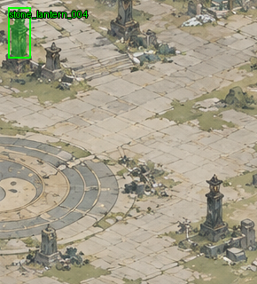
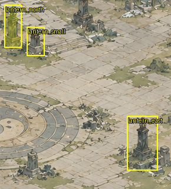
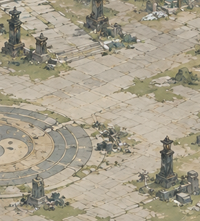
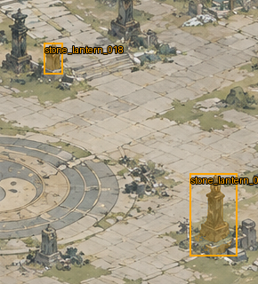
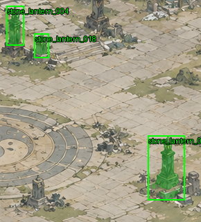

# Benchmark: sect_ruins_courtyard_001

GT: draft; mock: False; truncated: False

Mask metrics are measured only where masks are annotated; bbox GT does not imply pixel accuracy.

## roi_completion

```json
{
  "semantic_coverage": 0.7933317016731933,
  "unassigned_ratio": 0.20666829832680667,
  "residual_pixel_ratio": 0.034609736561053754,
  "instance_pixel_ratio": 0.7933317016731933,
  "background_pixel_ratio": 0.0,
  "definition": "QA-passed source-visible pixels inside ROI, excluding ignore regions. Residual is a subset of unassigned, not additive. Not GT pixel correctness."
}
```

## completion

```json
{
  "status": "partial",
  "scene": {
    "semantic_coverage": 0.4228903452555339,
    "predicted_semantic_coverage": 0.5117270151774089,
    "unassigned_ratio": 0.5771096547444661,
    "unassigned_pixel_ratio": 0.5771096547444661,
    "residual_pixel_ratio": 0.4882729848225911,
    "semantic_pixel_ratio": 0.4228903452555339,
    "background_pixel_ratio": 0.0,
    "instance_pixel_ratio": 0.4228903452555339
  },
  "objects": {
    "detected": 122,
    "evaluated_assets": 122,
    "accepted": 31,
    "asset_ready": 31,
    "needs_review": 87,
    "rejected": 4,
    "asset_ready_ratio": 0.2540983606557377,
    "review_ratio": 0.7131147540983607,
    "failed_ratio": 0.03278688524590164,
    "delivery_review": 91
  },
  "quality": {
    "duplicate_rate": null,
    "fragmentation_rate": null,
    "mean_mask_iou": null,
    "candidate_dedup_ratio": 0.585419734904271
  },
  "reconstruction": {
    "similarity": 1.0
  },
  "definitions": {
    "semantic_coverage": "Union of QA-passed source-visible instance/terrain masks over nontransparent source pixels; predicted quality, not GT recall.",
    "predicted_semantic_coverage": "All assigned source masks including review candidates; excludes residual.",
    "unassigned_ratio": "Pixels without QA-passed semantics, including residual. Not additive with residual.",
    "background_pixel_ratio": "QA-passed visible terrain pixels; excludes residual and generated completion.",
    "asset_ready": "Persisted base cutout and segmentation, QA pass, no unresolved content/boundary review; optional HD excluded.",
    "quality": "GT recall, precision, final duplicate/fragmentation/mask quality are unavailable until Benchmark evaluation.",
    "reconstruction": "Pixel fidelity only; residual may produce 1.0 with low semantic coverage."
  }
}
```

## detection

```json
{
  "recall": 1.0,
  "precision": 1.0,
  "duplicate_rate": 0.0,
  "fragmentation_rate": 0.0,
  "miss_rate": 0.0,
  "gt_count": 3,
  "prediction_count": 3,
  "true_positive_count": 3,
  "false_positive_count": 0,
  "duplicate_count": 0,
  "fragmented_gt_count": 0,
  "by_size": {
    "small": {
      "gt": 1,
      "detected": 1,
      "recall": 1.0
    },
    "medium": {
      "gt": 2,
      "detected": 2,
      "recall": 1.0
    },
    "large": {
      "gt": 0,
      "detected": 0,
      "recall": null
    }
  }
}
```

## mask_quality

```json
{
  "iou": 0.5858421480878763,
  "dice": 0.7388404309902514,
  "boundary_fscore": 0.8079800498753118,
  "completeness": 0.6244579358196011,
  "contamination": 0.09547738693467336
}
```

## semantic_regions

```json
[]
```

## scan_cost

```json
{
  "calls": 19,
  "global_passes": 1,
  "tile_passes": 1,
  "retry_calls": 3,
  "by_source": {
    "global": 4,
    "tile": 12,
    "redetection": 3
  },
  "max_total_inference_calls": 100,
  "max_retry_calls": 3
}
```

## performance

```json
{
  "runtime": 187.19641280174255,
  "peak_ram_mb": 2264.484375,
  "peak_vram_mb": null
}
```

## gate

```json
{
  "status": "WARN",
  "checks": {
    "recall": {
      "baseline": 1.0,
      "current": 1.0,
      "delta": 0.0,
      "limit": 0.02,
      "status": "PASS"
    },
    "precision": {
      "baseline": 1.0,
      "current": 1.0,
      "delta": 0.0,
      "limit": 0.03,
      "status": "PASS"
    },
    "duplicate_rate": {
      "baseline": 0.0,
      "current": 0.0,
      "delta": 0.0,
      "limit": 0.02,
      "status": "PASS"
    },
    "runtime": {
      "baseline": 216.9093029499054,
      "current": 187.19641280174255,
      "delta": -0.13698301430171925,
      "limit": 0.2,
      "status": "PASS"
    },
    "boundary_fscore": {
      "baseline": 0.8079800498753118,
      "current": 0.8079800498753118,
      "delta": 0.0,
      "limit": 0,
      "status": "PASS"
    },
    "validity": {
      "status": "WARN",
      "reason": "truncated/mock/draft GT; not an acceptance gate"
    }
  }
}
```

## metric_definitions

```json
{
  "matching": "Confidence-ordered category-aware one-to-one IoU matching within ROI; duplicate predictions also lower precision.",
  "duplicates": "Unmatched predictions overlapping an already matched GT at IoU threshold / predictions.",
  "fragmentation": "GT instances containing at least two distinct nonoverlapping partial boxes / instance GT; heuristic, not amodal GT.",
  "size": "BBox area / original scene area; no resizing-dependent thresholds.",
  "mask_quality": "Visible-mask metrics conditional on a matched, mask-annotated GT; missing predicted masks score zero. Unmatched GT reported as misses.",
  "semantic_coverage": "QA-passed visible pixel union; GT semantic-region scores are separate and unavailable without mask GT."
}
```

## Missed objects

None

## Visualizations









